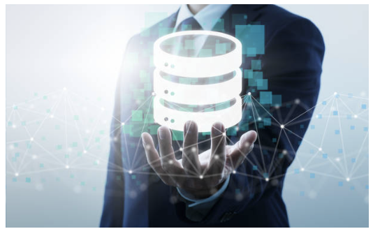

Als Datenbank-Technologie kommt MariaDb mit Galera Cluster zum Einsatz.
Da das System dezentralisiert ist, sorgt der Galera Cluster für die Synchronisierung aller Datenbanken.
Damit egal an welchem Raspberry-Frontend der Admin Änderungen am System vornimmt, es an jeder Tür wirksam wird.

